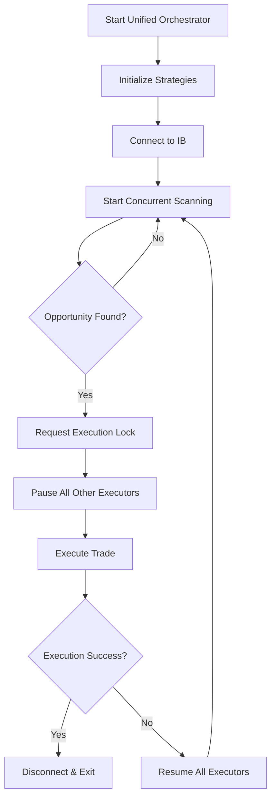

# ADR-005: Unified Strategy Execution for SFR and Synthetic Arbitrage

## Status
Proposed

## Context
Currently, the SFR (Synthetic Free Risk) and Synthetic arbitrage strategies operate independently, requiring separate execution runs and IB connections. This leads to:
- Inefficient resource utilization (multiple IB connections)
- Missed opportunities when running strategies sequentially
- No coordination between strategies when competing for the same execution window
- Duplicate scanning of the same symbols
- Separate logging and monitoring streams

### Current Architecture Limitations
1. **Independent Execution**: Each strategy runs in isolation with its own IB connection
2. **No Cross-Strategy Coordination**: Strategies can't communicate or coordinate executions
3. **Resource Duplication**: Each strategy maintains its own caches, connections, and executors
4. **Sequential Operation**: Must run strategies one after another, missing real-time opportunities

## Decision
Implement a Unified Strategy Orchestrator that enables concurrent execution of both SFR and Synthetic strategies with shared resources and coordinated execution control.

## Architecture Design

### 1. Component Structure

```
modules/Arbitrage/
├── unified/
│   ├── __init__.py
│   ├── orchestrator.py         # Main unified orchestrator
│   ├── execution_coordinator.py # Coordinates execution across strategies
│   └── state_manager.py        # Manages shared state
├── common/
│   ├── global_execution_lock.py # Shared lock for all strategies
│   ├── unified_logger.py       # Unified logging infrastructure
│   └── shared_metrics.py       # Cross-strategy metrics
```

### 2. Core Components

#### 2.1 Unified Orchestrator (`orchestrator.py`)
```python
class UnifiedOrchestrator:
    """
    Orchestrates concurrent execution of multiple arbitrage strategies.

    Responsibilities:
    - Initialize and manage both SFR and Synthetic strategies
    - Share single IB connection between strategies
    - Coordinate scanning and execution phases
    - Handle disconnect on successful execution
    - Manage unified logging and metrics
    """

    def __init__(self, config: UnifiedConfig):
        self.ib = IB()  # Single shared connection
        self.sfr_strategy = None
        self.syn_strategy = None
        self.execution_coordinator = ExecutionCoordinator()
        self.state_manager = StateManager()
        self.active_strategies = []

    async def run(self, symbol_list: List[str]) -> None:
        """Main execution loop for unified strategies"""
        # Initialize strategies with shared resources
        # Start concurrent scanning
        # Coordinate execution blocking
        # Handle completion and disconnection
```

#### 2.2 Execution Coordinator (`execution_coordinator.py`)
```python
class ExecutionCoordinator:
    """
    Coordinates execution across multiple strategies.

    Responsibilities:
    - Enforce single execution at a time across all strategies
    - Pause all executors when one strategy begins execution
    - Resume all executors on execution failure
    - Trigger disconnect on successful execution
    """

    async def request_execution(self,
                                strategy_type: str,
                                symbol: str,
                                executor_id: str) -> bool:
        """Request permission to execute, blocking other strategies"""

    async def notify_execution_complete(self,
                                       strategy_type: str,
                                       success: bool) -> None:
        """Handle execution completion, resume or disconnect"""
```

#### 2.3 State Manager (`state_manager.py`)
```python
class StateManager:
    """
    Manages shared state across strategies.

    Responsibilities:
    - Track active executors across all strategies
    - Monitor execution states
    - Coordinate pause/resume operations
    - Maintain execution history
    """

    def pause_all_executors(self, except_strategy: str = None) -> None:
        """Pause all executors across strategies"""

    def resume_all_executors(self) -> None:
        """Resume all paused executors"""

    def should_disconnect(self) -> bool:
        """Check if conditions met for disconnection"""
```

### 3. Execution Flow



### 4. Global Execution Lock Enhancement

```python
@dataclass
class UnifiedLockInfo:
    """Enhanced lock info for multi-strategy coordination"""
    strategy_type: str  # "SFR" or "Synthetic"
    symbol: str
    executor_id: str
    lock_time: float
    operation: str
    expected_duration: float  # Estimated execution time

class GlobalExecutionLock:
    """Enhanced singleton lock for multi-strategy coordination"""

    async def acquire_for_strategy(self,
                                  strategy_type: str,
                                  symbol: str,
                                  executor_id: str,
                                  timeout: Optional[float] = None) -> bool:
        """Acquire lock with strategy context"""

    def get_blocking_strategy(self) -> Optional[str]:
        """Get which strategy currently holds the lock"""
```

### 5. CLI Interface

```python
# New unified command in alchimest.py
parser_unified = subparsers.add_parser(
    "unified",
    help="Run SFR and Synthetic strategies concurrently with coordinated execution"
)

# SFR-specific arguments
parser_unified.add_argument("--sfr-enabled", action="store_true",
                           help="Enable SFR strategy")
parser_unified.add_argument("--sfr-profit", type=float,
                           help="SFR minimum ROI")
parser_unified.add_argument("--sfr-cost-limit", type=float,
                           help="SFR cost limit")

# Synthetic-specific arguments
parser_unified.add_argument("--syn-enabled", action="store_true",
                           help="Enable Synthetic strategy")
parser_unified.add_argument("--syn-max-loss", type=float,
                           help="Synthetic max loss")
parser_unified.add_argument("--syn-max-profit", type=float,
                           help="Synthetic max profit")
parser_unified.add_argument("--syn-scoring-strategy",
                           choices=["balanced", "aggressive", "conservative"],
                           help="Synthetic scoring strategy")

# Shared arguments
parser_unified.add_argument("--symbols", nargs="+", required=True,
                           help="Symbols to scan")
parser_unified.add_argument("--quantity", type=int, default=1,
                           help="Number of contracts")
parser_unified.add_argument("--log", type=str,
                           help="Unified log file")
```

### 6. Configuration Management

```python
@dataclass
class UnifiedConfig:
    """Configuration for unified strategy execution"""

    # Shared configuration
    symbols: List[str]
    quantity: int
    log_file: Optional[str]

    # SFR configuration
    sfr_enabled: bool
    sfr_profit_target: float
    sfr_cost_limit: float
    sfr_max_combinations: int

    # Synthetic configuration
    syn_enabled: bool
    syn_max_loss: float
    syn_max_profit: float
    syn_profit_ratio: float
    syn_scoring_config: ScoringConfig

    # Execution configuration
    disconnect_on_fill: bool = True
    max_parallel_scans: int = 5
    execution_timeout: float = 300.0
```

### 7. Unified Logging

```python
class UnifiedLogger:
    """Unified logging for multi-strategy execution"""

    def __init__(self, log_file: Optional[str] = None):
        self.handlers = []
        self.setup_handlers(log_file)

    def log_strategy_event(self,
                          strategy_type: str,
                          level: str,
                          message: str,
                          **kwargs) -> None:
        """Log with strategy context prefix"""
        formatted_msg = f"[{strategy_type}] {message}"
        # Include metadata like symbol, timestamp, metrics
```

## Implementation Plan

### Phase 1: Infrastructure (Week 1)
1. Extract and enhance GlobalExecutionLock to common module
2. Create StateManager for cross-strategy state
3. Implement ExecutionCoordinator for blocking logic
4. Setup unified logging infrastructure

### Phase 2: Orchestrator (Week 2)
1. Implement UnifiedOrchestrator class
2. Modify strategy base classes for external control
3. Add pause/resume hooks to executors
4. Implement shared IB connection management

### Phase 3: Integration (Week 3)
1. Create unified CLI command
2. Implement configuration management
3. Add unified metrics collection
4. Create integration tests

### Phase 4: Testing & Optimization (Week 4)
1. Comprehensive testing of concurrent execution
2. Performance optimization for shared resources
3. Failure scenario testing
4. Documentation and examples

## Consequences

### Positive
- **Improved Efficiency**: Single IB connection, shared resources
- **Better Opportunity Capture**: Concurrent scanning finds more opportunities
- **Coordinated Execution**: No conflicts between strategies
- **Unified Monitoring**: Single log stream and metrics dashboard
- **Resource Optimization**: Shared caches and data structures
- **Simplified Operations**: One command to run both strategies

### Negative
- **Increased Complexity**: More complex coordination logic
- **Debugging Challenges**: Harder to isolate strategy-specific issues
- **Configuration Overhead**: More parameters to manage
- **Testing Complexity**: Need comprehensive multi-strategy tests

### Neutral
- **Breaking Change**: Existing single-strategy commands remain but new unified mode is preferred
- **Migration Path**: Gradual adoption possible, old commands still work

## Risk Mitigation

1. **Execution Conflicts**: Global lock ensures atomic execution
2. **Resource Contention**: Semaphores limit concurrent operations
3. **Failure Cascades**: Isolated error handling per strategy
4. **Performance Degradation**: Monitoring and profiling built-in
5. **Configuration Errors**: Validation at startup with clear error messages

## Monitoring & Observability

### Metrics to Track
- Opportunities found per strategy
- Execution attempts and success rate
- Lock contention and wait times
- Strategy-specific performance metrics
- Resource utilization (connections, memory)

### Logging Strategy
- Strategy-prefixed log entries
- Correlation IDs for tracking execution flow
- Detailed timing information
- State transitions logged

## Example Usage

```bash
# Run both strategies with custom parameters
python alchimest.py unified \
  --symbols SPY QQQ AAPL MSFT TSLA \
  --sfr-enabled \
  --sfr-profit 0.75 \
  --sfr-cost-limit 100 \
  --syn-enabled \
  --syn-max-loss 50 \
  --syn-max-profit 100 \
  --syn-scoring-strategy balanced \
  --quantity 2 \
  --log unified_trading.log

# Run only SFR in unified mode (for testing)
python alchimest.py unified \
  --symbols SPY \
  --sfr-enabled \
  --sfr-profit 0.5 \
  --sfr-cost-limit 120

# Run with aggressive synthetic and conservative SFR
python alchimest.py unified \
  --symbols QQQ IWM TLT \
  --sfr-enabled \
  --sfr-profit 1.0 \
  --syn-enabled \
  --syn-scoring-strategy aggressive \
  --syn-max-loss 30
```

## Testing Strategy

### Unit Tests
- Test each component in isolation
- Mock IB connections and market data
- Verify lock acquisition and release
- Test state transitions

### Integration Tests
- Test strategy coordination
- Verify execution blocking
- Test failure recovery
- Validate disconnect logic

### Performance Tests
- Measure overhead of coordination
- Test with multiple symbols
- Verify resource sharing efficiency
- Profile memory usage

## Future Enhancements

1. **Dynamic Strategy Loading**: Plugin architecture for new strategies
2. **Priority-Based Execution**: Prioritize higher-value opportunities
3. **Smart Symbol Distribution**: Distribute symbols based on strategy strengths
4. **ML-Based Coordination**: Learn optimal execution patterns
5. **Web Dashboard**: Real-time monitoring interface
6. **Strategy Chaining**: Execute complementary strategies in sequence

## References
- ADR-003: Parallel Execution Framework
- ADR-004: Global Execution Lock Design
- SFR Strategy Documentation
- Synthetic Strategy Documentation

## Decision Makers
- Strategy Team Lead
- Risk Management
- Trading Operations
- System Architecture Team

## Date
2024-11-21

## Review Schedule
- Initial Review: 2 weeks after implementation start
- Performance Review: After 100 executions
- Full Review: 3 months post-deployment
